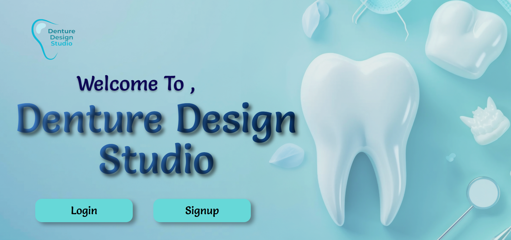
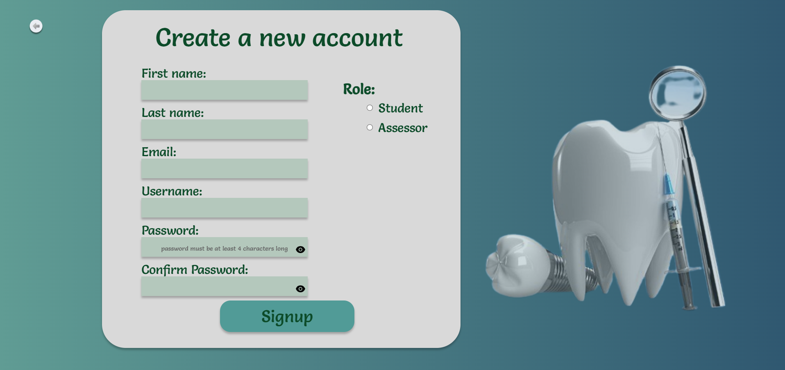
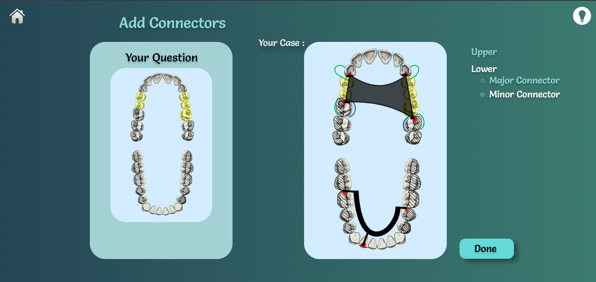
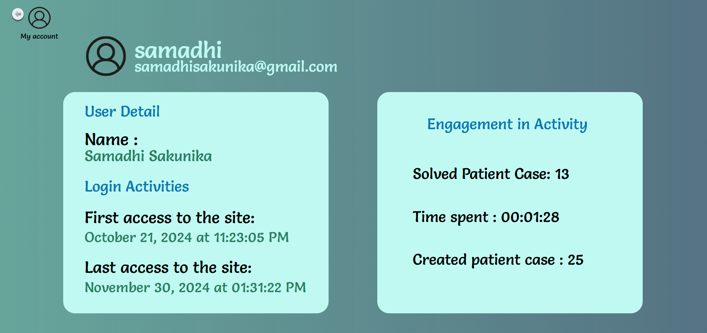

# Denture Design Studio

---

## Team

- **E/20/346** - Samarakoon S.M.P.H. ([e20346@eng.pdn.ac.lk](mailto:e20346@eng.pdn.ac.lk))
- **E/20/367** - Senavirathna D.B.C.M. ([e20367@eng.pdn.ac.lk](mailto:e20367@eng.pdn.ac.lk))
- **E/20/419** - Wakkumbura M.M.S.S. ([e20419@eng.pdn.ac.lk](mailto:e20419@eng.pdn.ac.lk))
- **E/20/439** - Wickramasinghe J.M.W.G.R.L. ([e20439@eng.pdn.ac.lk](mailto:e20439@eng.pdn.ac.lk))

---

## Supervisors

- Dr. Isuru Nawinne ([isurunawinne@eng.pdn.ac.lk](mailto:isurunawinne@eng.pdn.ac.lk))
- Dr. Sumudu Rasanayake ([srasanayaka@dental.pdn.ac.lk](mailto:srasanayaka@dental.pdn.ac.lk))

---

## Table of Contents

1. [Introduction](#introduction)
2. [Features](#features)
3. [Technologies Used](#technologies-used)
4. [User Interface](#user-interface)
   - [Signup Form](#signup-form)
   - [Denture Design Tool](#denture-design-tool)
   - [Engagement Metrics](#engagement-metrics)
5. [User Manual](#user-manual)
6. [Links](#links)
7. [Contact](#contact)

---

## Introduction

*Denture Design Studio* is an innovative graphical platform designed specifically for dental students. It provides tools for **real-time denture design**, enabling students to create and refine denture models while receiving guidance from assessors. The platform also includes features for **self-evaluation**, empowering students to independently enhance their skills.

---

## Features

- **Interactive Design Tools**: Real-time graphical interface for designing dentures.
- **Self-Evaluation Mechanism**: Built-in feedback and analysis tools for students.
- **Assessor Integration**: Features to provide assessors' feedback on student designs.
- **Intuitive User Interface**: Easy-to-use design tailored for dental education.

---

## Technologies Used

- **Frontend**: React.js for building the user interface.
- **Backend**: Node.js for handling server-side operations.
- **Database**: MongoDB for storing user data and designs.
- **Deployment**: Render for deployment of web application.

---

## User Interface

  
*Figure 1: Home Page Interface*

### Signup Form

Users can sign up to the system by duly filling the signup form and assigning the role. Assessor account features are enabled only after verification by the admin.

  
*Figure 2: Signup Form*

---

### Denture Design Tool

The **Design Tool** allows students to create and refine their denture designs interactively. It includes drag-and-drop functionality, precision controls, and real-time feedback.  
A finalized denture would look as follows:

  
*Figure 3: Denture Design Tool*

---

### Engagement Metrics

Admin and Assessor roles can view each student's login and case interaction activity on the platform and track their engagement.

  
*Figure 4: Engagement Metrics of Student Account*

---

## User Manual

[Download user manual here](./UserManual_Denture_Design_Studio.pdf)

---

## Links

- [Project Repository](https://github.com/cepdnaclk/e20-co227-Denture-Design-Studio)
- [Project Page](https://cepdnaclk.github.io/e20-co227-Denture-Design-Studio)

---

## Contact

For further inquiries, feel free to contact any team member or email us at [e20346@eng.pdn.ac.lk](mailto:e20346@eng.pdn.ac.lk).
